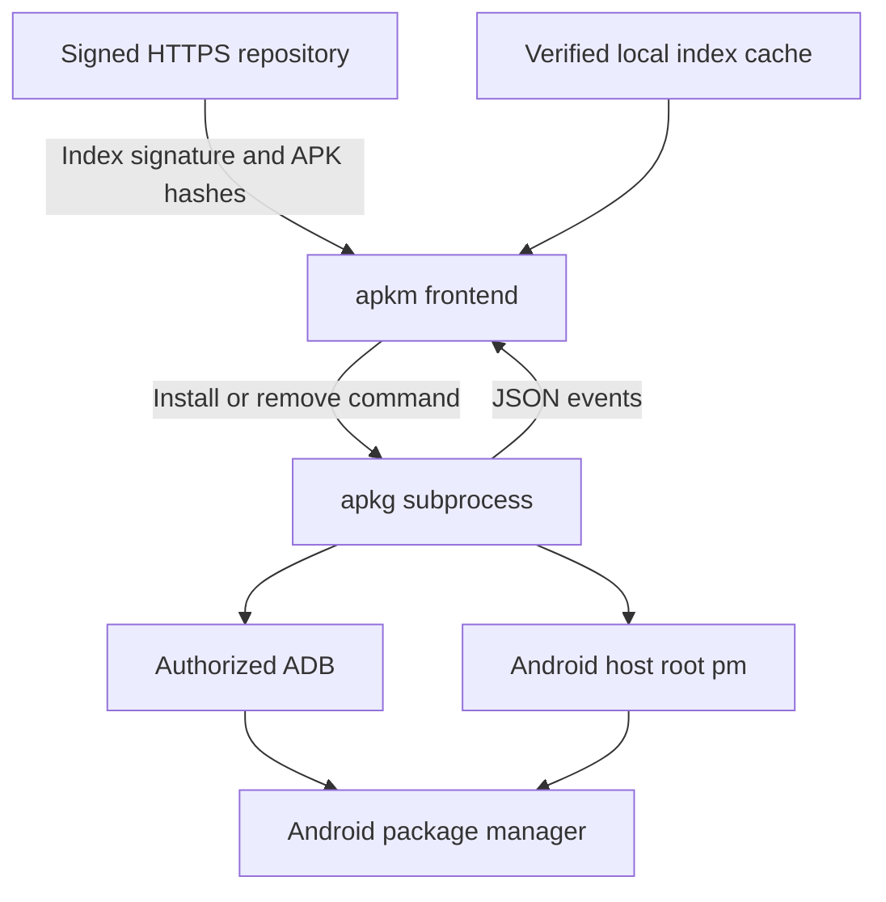

# APKM / APKG — Android APK manager

[简体中文](https://github.com/villager1314/repo/blob/main/README.zh-CN.md) | English

[](https://github.com/villager1314/repo/actions/workflows/ci.yml)
[](https://github.com/villager1314/repo/actions/workflows/pages.yml)
[](https://github.com/villager1314/repo/releases)
[](https://github.com/villager1314/repo/blob/main/LICENSE)

Download verified APKs from signed repositories and install them through authorized ADB or Android host root. **APKM is the repository frontend; APKG is the installation backend.** The name APKM refers to this project, not the `.apkm` container format. APKG manages Android apps, not Arch Linux pkg archives. Only standalone APK files are supported.

## Contents

- [Architecture](#architecture)
- [Supported environments](#supported-environments)
- [Install](#install)
- [Use](#use)
- [Trust and cache](#trust-and-cache)
- [Troubleshooting](#troubleshooting)
- [Development and releases](#development-and-releases)
- [Documentation](#documentation)

## Architecture



APKM resolves repository metadata, verifies downloads and reads live JSON events from APKG. Android owns the installed-app state and enforces APK signing compatibility. Downloads show actual byte counts; installation reports Android status, without simulated percentages.

## Supported environments

| Environment | Package / repository | Targets |
| --- | --- | --- |
| Debian / Ubuntu | Debian `all` package | amd64, arm64 |
| Arch / Arch Linux ARM | Arch `any` package | x86_64, aarch64 |
| Termux, standard `com.termux` prefix | Separate Termux `all` package | aarch64, x86_64 |

CachyOS compatibility remains to be tested. Linux root, chroot root and PRoot simulated root do not grant Android host root. Physical Android installation/removal and native Arch/ARM64/Termux compatibility remain outside the completed test coverage; see [validation](https://github.com/villager1314/repo/blob/main/VALIDATION.md).

## Install

Repository signing-key fingerprint:

```text
C198FBB87F5D87047E86DD24995549BDF64D01F9
```

Cross-check it through an independent trusted channel before trusting the key. A fingerprint and key downloaded from this same website alone do not independently authenticate the publisher.

### Debian / Ubuntu

Download the key and install it after checking the fingerprint:

```sh
curl -fL https://villager1314.github.io/repo/keys/apkm.gpg -o apkm.gpg
gpg --show-keys --with-fingerprint apkm.gpg
sudo install -m 644 apkm.gpg /usr/share/keyrings/apkm.gpg
```

Add one line to `/etc/apt/sources.list.d/apkm.list`:

```text
deb [arch=amd64 signed-by=/usr/share/keyrings/apkm.gpg] https://villager1314.github.io/repo/debian/amd64/ ./
```

For ARM64, replace both `amd64` occurrences with `arm64`.

```sh
sudo apt update
sudo apt install --no-install-recommends apkm
```

### Arch / Arch Linux ARM

Download and check the same key, then replace `FINGERPRINT` with the full fingerprint above:

```sh
sudo pacman-key --add apkm.gpg
sudo pacman-key --lsign-key FINGERPRINT
```

Append to `/etc/pacman.conf`:

```ini
[apkm]
SigLevel = Required
Server = https://villager1314.github.io/repo/arch/$arch/
```

```sh
sudo pacman -Syu apkm
```

### Termux

Follow [the Termux guide](https://github.com/villager1314/repo/blob/main/docs/TERMUX.md) for the dedicated repository, key setup and wireless ADB. Use `apt install --no-install-recommends apkm` to avoid Python's recommended development toolchain. Use Debian packages inside Debian/Ubuntu PRoot, and Termux packages in native Termux.

## Use

```sh
apkm source add fdroid https://f-droid.org/repo --type fdroid
apkm search termux
apkm info com.termux
apkm install com.termux
apkm install --download-only --output-dir ./apks org.fdroid.fdroid
apkm install --keep-apk org.fdroid.fdroid
apkm update fdroid
apkm upgrade
apkm remove com.example.app
apkg install ./example.apk
apkm doctor
```

Global options precede the command:

```sh
apkm --mode adb --serial DEVICE install com.example.app
apkm --yes remove com.example.app
apkg --mode root install ./example.apk
LANG=C apkm --help
man apkm
man apkg
```

Removal uses Android package IDs, requires confirmation or `--yes`, and normally deletes app data. Duplicate IDs are deduplicated, absent apps are skipped, and processing stops at the first failure. Successfully removed apps remain removed. Removal requires no repository index.

Help uses Chinese for `zh` locales and English otherwise. The manuals are English; runtime logs are still mostly Chinese. `LC_ALL=C` overrides other locale settings when requesting English help.

## Trust and cache

The production client supports the project's signed APKM index and F-Droid v1 JSON with detached GPG signatures. Generic signed-JAR adapters for IzzyOnDroid, Guardian, microG and NewPipe remain unimplemented; see [source compatibility](https://github.com/villager1314/repo/blob/main/docs/APK-SOURCES.md).

Source addition, mirror switching and `apkm update` download and verify indexes. Search, info, install and upgrade read the verified local cache. The F-Droid main index is about 64 MB; incremental updates are not implemented. Each source replaces its cache instead of retaining historical copies. Duplicate configured sources can still occupy separate cache space.

```sh
apkm source set-url fdroid https://mirrors.tuna.tsinghua.edu.cn/fdroid/repo
```

TUNA and NYIST mirror F-Droid's main repository, not the third-party repositories listed above. Mirror switching retains the trusted key and rollback checks. APKs are deleted only after successful installation and installed-version confirmation. Failed installs and download-only operations retain them; `--keep-apk` preserves successful downloads. APKG never deletes user-supplied local APKs.

Split APK, APKS, XAPK and `.apkm` containers are unsupported. Updates do not bypass signing conflicts by uninstalling apps. The self-hosted APK repository starts empty; maintainers must add APKs they have permission to distribute.

## Troubleshooting

Start with `apkm doctor` and `adb devices`. See [the troubleshooting guide](https://github.com/villager1314/repo/blob/main/docs/TROUBLESHOOTING.md) for pairing failures, multiple devices, trust failures, APK signing conflicts, missing caches and Termux library mismatches.

## Development and releases

```sh
python3 -m unittest discover -s tests -v
python3 scripts/check_repositories.py
```

Repository checks require `dpkg-deb`, APT, `gpgv` and `zstd`, and operate with isolated APT state. Builds additionally require signing tools. [Maintainer instructions](https://github.com/villager1314/repo/blob/main/docs/MAINTAINING.md) cover package builds, signing and release assets. GitHub Pages publishes `site/`; private signing keys must never enter the repository or CI.

[Changelog](https://github.com/villager1314/repo/blob/main/CHANGELOG.md) · [Releases](https://github.com/villager1314/repo/releases) · [Contributing](https://github.com/villager1314/repo/blob/main/CONTRIBUTING.md) · [Report an issue](https://github.com/villager1314/repo/issues/new/choose)

## Documentation

- [Termux](https://github.com/villager1314/repo/blob/main/docs/TERMUX.md), [F-Droid](https://github.com/villager1314/repo/blob/main/docs/FDROID.md), [other APK sources](https://github.com/villager1314/repo/blob/main/docs/APK-SOURCES.md): detailed guides currently in Chinese.
- [Troubleshooting](https://github.com/villager1314/repo/blob/main/docs/TROUBLESHOOTING.md), [maintenance](https://github.com/villager1314/repo/blob/main/docs/MAINTAINING.md), [contributing](https://github.com/villager1314/repo/blob/main/CONTRIBUTING.md): English.
- [Validation](https://github.com/villager1314/repo/blob/main/VALIDATION.md): versioned test coverage and device limitations.
- English man pages: [apkm](https://github.com/villager1314/repo/blob/main/docs/apkm.1), [apkg](https://github.com/villager1314/repo/blob/main/docs/apkg.1).

Licensed under [MIT](https://github.com/villager1314/repo/blob/main/LICENSE).
