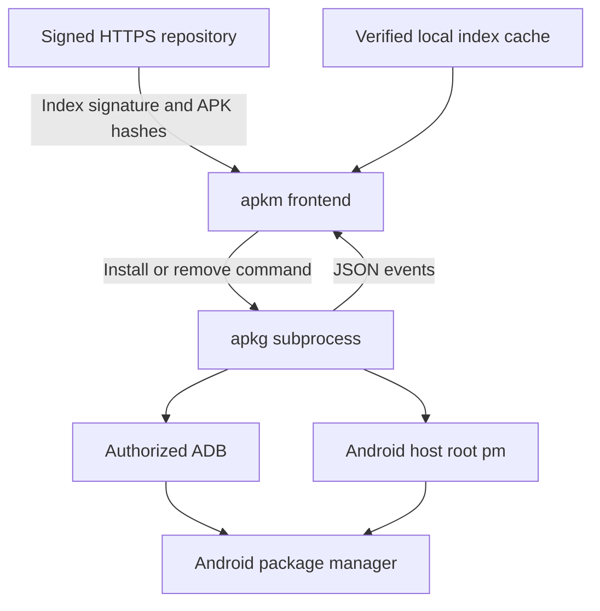

# APKM / APKG — Android APK 管理工具

[English](https://github.com/villager1314/repo/blob/main/README.md) | 简体中文

APKM 是 APK 源客户端，APKG 是安装后端。这里的 APKM 与 `.apkm` 容器格式无关；APKG 不管理 Arch 的 pkg 软件包。本工具仅处理独立 APK。

可信源下载 → 校验 → ADB 或安卓宿主 root 安装。

[](https://github.com/villager1314/repo/actions/workflows/ci.yml)
[](https://github.com/villager1314/repo/actions/workflows/pages.yml)
[](https://github.com/villager1314/repo/releases)
[](https://github.com/villager1314/repo/blob/main/LICENSE)

从签名 APK 软件源下载应用，通过 ADB 或安卓宿主 root 安装。
提供 Debian（amd64 / arm64）及 Arch（x86_64 / aarch64）四个软件源。
Python 实现不包含本机二进制，Debian 使用 all 包，Arch 使用 any 包。

## 目录

- [架构](#架构)
- [Termux 安装](#termux-安装)
- [Debian 安装](#debian-安装)
- [Arch / Arch Linux ARM 安装](#arch--arch-linux-arm-安装)
- [添加 APK 源及安装](#添加-apk-源及安装)
- [F-Droid 与缓存](#f-droid-与缓存)
- [文档与故障排查](#文档与故障排查)

## 架构



apkm 验证索引、选择应用并校验下载；安装和卸载交给 apkg 子进程执行，实时读取 JSON 事件。Android 管理已安装状态并执行 APK 签名兼容性检查。

## 发布到 GitHub Pages

1. 在 GitHub 新建公开仓库 `repo`，将本项目的内容上传到仓库根目录。
2. 默认分支为 main；Settings → Pages → Source 选择 GitHub Actions。
3. 自带工作流只发布 `site/`。不要把签名私钥上传到仓库。
4. 发布后入口为 https://villager1314.github.io/repo/ 。如果用户名或仓库名不同，替换本文和 site/index.html 中的 URL。

软件源已发布在 https://villager1314.github.io/repo/ ，由 GitHub Actions 更新。
APK 源初始为空；不会默认转载第三方 APK。

## Termux 安装

已增加独立的 `termux/` 软件源，适配标准 com.termux 的 aarch64 / x86_64 环境。
使用 Termux 的 Python、android-tools、gpgv，不使用 Debian 的安装路径。
完整安装、无线 ADB 配对及 root 用法见 [Termux 使用说明](https://github.com/villager1314/repo/blob/main/docs/TERMUX.md)。
实机兼容性尚待验证。

## Debian 安装

仓库签名公钥指纹：`C198FBB87F5D87047E86DD24995549BDF64D01F9`。通过独立可信渠道交叉核对；README 与公钥来自同一网站不能作为独立认证。
下载 `https://villager1314.github.io/repo/keys/apkm.gpg`，执行：

```sh
sudo install -m 644 apkm.gpg /usr/share/keyrings/apkm.gpg
```

amd64 的 `/etc/apt/sources.list.d/apkm.list`：

```text
deb [arch=amd64 signed-by=/usr/share/keyrings/apkm.gpg] https://villager1314.github.io/repo/debian/amd64/ ./
```

arm64 使用：

```text
deb [arch=arm64 signed-by=/usr/share/keyrings/apkm.gpg] https://villager1314.github.io/repo/debian/arm64/ ./
```

```sh
sudo apt update
sudo apt install --no-install-recommends apkm
```

也可以先安装随附的本地 deb：`sudo apt install ./apkm_0.3.5-1_all.deb`。
包包含 apkm、apkg、两份 man 手册和 APK 源公钥。

## Arch / Arch Linux ARM 安装

核对指纹后导入公钥（将 FINGERPRINT 替换成实际指纹）：

```sh
sudo pacman-key --add apkm.gpg
sudo pacman-key --lsign-key FINGERPRINT
```

在 `/etc/pacman.conf` 末尾添加：

```ini
[apkm]
SigLevel = Required
Server = https://villager1314.github.io/repo/arch/$arch/
```

```sh
sudo pacman -Syu apkm
```

不关闭签名验证。CachyOS 的兼容性需在你的系统上另行验证。
Arch ARM 目标为 aarch64，不支持 32 位 armv7。

## 添加 APK 源及安装

```sh
apkm source add personal https://villager1314.github.io/repo/android/ --keyring /usr/share/apkm-keyring.gpg
apkm update
apkm search 关键字
apkm info 软件名
apkm install 软件名
apkm install --download-only 软件名
apkm upgrade
apkg install ./软件.apk
apkg list
apkg info com.example.app
apkg --yes remove com.example.app
apkm doctor
man apkm
man apkg
```

全局参数放在命令前：

```sh
apkm --mode adb --serial DEVICE install 软件名
apkg --mode root install ./软件.apk
apkg --json install ./软件.apk
```

ADB 模式需要设备授权。无线 ADB 先用 `adb pair 地址:配对端口` 和
`adb connect 地址:调试端口` 配对连接；两种端口可能不同。
Linux 的 root、chroot root 或 PRoot 模拟 root 不等于安卓宿主 root。
root 模式要求宿主 su、/system/bin/pm、getprop 可访问，并确认安卓 uid=0；
通过 stdin 向 pm 传 APK，避免把容器路径误当成安卓可访问路径。
若这些条件不成立，使用已授权的无线 ADB。
无 root 且无 ADB 授权时返回错误，不提供静默绕过。

## 添加自己的 APK

维护端安装 `aapt`，从 APK 自动读取包名、versionCode、SDK 和 ABI。
只添加有权分发的独立 APK；不改 APK 自身签名。

```sh
python3 scripts/add_apk.py 软件名 /路径/软件.apk --key FINGERPRINT --description '软件简介'
```

脚本复制 APK 到 `site/android/apks/`，更新 revision 和 SHA256，并重新签名。
提交更新的 site/android/ 即可部署。没有 APK 时目录含 .gitkeep。
只支持单 APK；不支持 split APK、APKS、XAPK 或 APKM 容器格式。
软件名 apkm 与 .apkm 容器格式没有关系。

## 重新构建

Debian/Ubuntu 构建端需要：python3、dpkg-dev、zstd、gnupg。

```sh
python3 scripts/build.py --key FINGERPRINT
python3 -m unittest discover -s tests -v
```

Linux 软件包及各源存放在 site/；构建中间文件存放在 build/。
本次已生成专用签名公钥；私钥另附私密备份文件，不能公开。
先导入该私钥或改用你自己的签名密钥再维护发布。
首次公开发布前可更换密钥；更换后重新构建并让客户端信任新公钥。

导入另附的备份：`gpg --import repository-private.asc`。
若构建环境无法启动 gpg-agent，可在构建端安装 PGPy，使用
`python3 scripts/build.py --private-key /私密路径/repository-private.asc`。
PGPy 仅为可选构建依赖，不是 apkm/apkg 的运行依赖。
项目中的 GitHub Actions 只发布已生成的网站，不读取签名私钥。

## 实现和限制

- apkm 实际启动 apkg 子进程，逐行读取 JSON 事件。
- 源索引使用 GPG detached signature；下载前验证签名及 APK 的 SHA256/大小。
- HTTPS 下载拒绝跳转到 HTTP；源索引有大小限制和 revision 回退检测。
- 多个 ADB 设备时要求 --serial，root 模式不会仅凭 Linux uid 判断权限。
- 下载显示真实字节数/速度；安装只显示状态和安卓返回结果。
- Android 管理已安装状态，apkm 不维护独立安装数据库。
- 不自动降级、不卸载重装绕过签名冲突；卸载默认要求确认。
- --json 输出每行一个事件，不是单个 JSON 文档。
- 本地 APK 安装检查 ZIP 和 Manifest 存在；实际签名及 APK 合法性由安卓验证。
- 索引的包名、SDK 和 ABI 由维护者提供；可信仓库仍需维护准确元数据。
- 无自动安装权限弹窗、断点续传、后台服务和第三方 APK 抓取。
- Linux/安卓设备 ABI 不同；下载选择依据目标安卓设备，而非 Linux CPU。

详见 VALIDATION.md：本环境没有真实安卓设备及 Arch/ARM64 系统，不能声称已在这些系统实机通过。

## F-Droid 与缓存

```sh
apkm source add fdroid https://f-droid.org/repo --type fdroid
apkm search termux
apkm info com.termux
apkm install com.termux
```

搜索、查询和安装使用本地已验证索引，`apkm update [源名]` 主动刷新；索引约 64 MB，目前不支持增量更新。安装成功并核对版本后默认删除下载 APK，`--keep-apk` 保留；失败及 `--download-only` 保留。

```sh
apkm source set-url fdroid https://mirrors.tuna.tsinghua.edu.cn/fdroid/repo
apkm --yes remove com.example.app
LANG=C apkm --help
```

卸载使用安卓包名，无需源索引；通常删除应用数据。help 随系统语言选择中英文，man 为英文；运行日志仍主要为中文。

## 文档与故障排查

- [故障排查](https://github.com/villager1314/repo/blob/main/docs/TROUBLESHOOTING.md)：ADB 配对、多设备、公钥与签名、缓存、Termux 依赖。
- [Termux](https://github.com/villager1314/repo/blob/main/docs/TERMUX.md) · [F-Droid](https://github.com/villager1314/repo/blob/main/docs/FDROID.md) · [第三方源适配](https://github.com/villager1314/repo/blob/main/docs/APK-SOURCES.md)
- [版本历史](https://github.com/villager1314/repo/blob/main/CHANGELOG.md) · [贡献指南](https://github.com/villager1314/repo/blob/main/CONTRIBUTING.md) · [验证范围](https://github.com/villager1314/repo/blob/main/VALIDATION.md)
- [发布与下载](https://github.com/villager1314/repo/releases)
